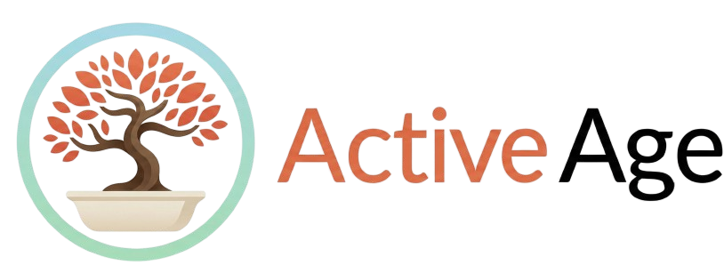

  

# 🩺 Active Age

**Plataforma Integral de Telessaúde Geriátrica**

Projeto de graduação em Desenvolvimento de Software Multiplataforma (DSM) - Fatec Diadema.

## 📖 Sobre o Projeto

O Active Age busca transformar a experiência de cuidado do paciente idoso, centralizando a jornada de saúde em um ambiente digital seguro. A plataforma conecta pacientes, cuidadores e médicos geriatras, oferecendo agendamento inteligente, teleconsulta integrada e um prontuário eletrônico imutável, com foco total em acessibilidade (WCAG) e segurança (LGPD).

## 🗂️ Estrutura do Repositório (Evolução por Semestres)

Este projeto está sendo construído de forma iterativa ao longo de 6 semestres letivos, aplicando os conceitos de Aprendizagem Baseada em Projetos (PBL).

- [📁 1º Semestre](./1-Semestre) - Fundamentação, Design e Prototipagem (Front-End Estático e Modelagem).
- [📁 2º Semestre](./2-Semestre) - Motor Relacional e Lógicas Iniciais (POO e Banco Relacional).
- [📁 3º Semestre](./3-Semestre) - APIs, Prontuário Flexível e Gestão Ágil (NoSQL e IHC).
- [📁 4º Semestre](./4-Semestre) - Mundo Mobile e Automação (React Native/Flutter e CI/CD).
- [📁 5º Semestre](./5-Semestre) - Segurança, LGPD e Nuvem (Cloud, Machine Learning Básica).
- [📁 6º Semestre](./6-Semestre) - Telessaúde de Ponta e NLP (WebRTC, Speech-to-Text).
